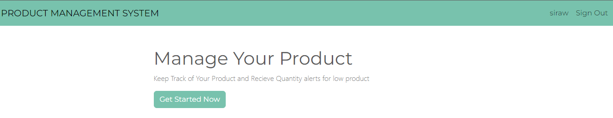
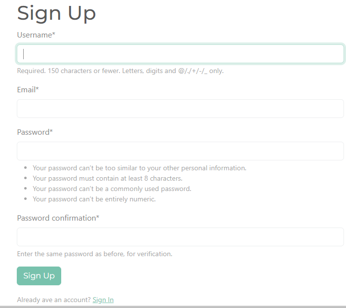
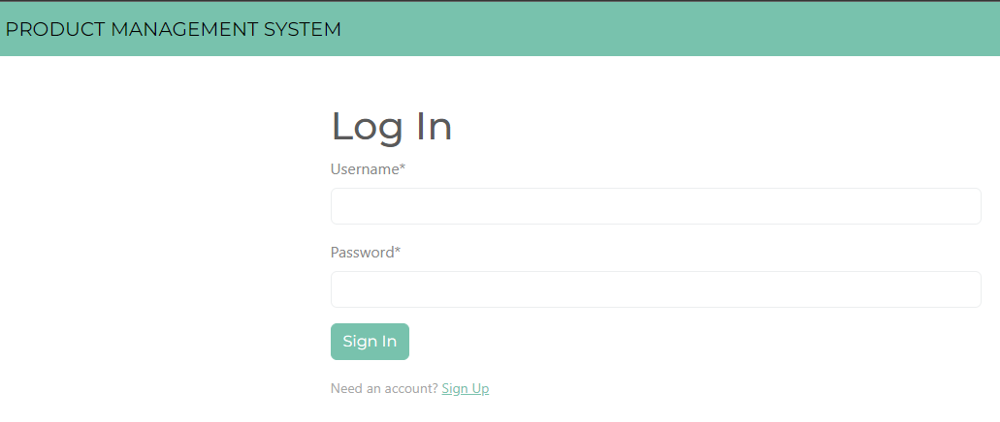
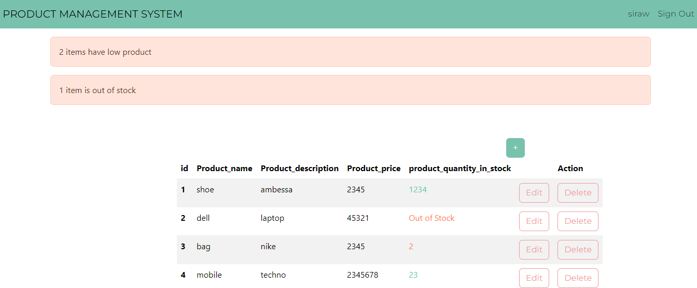
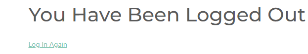

<<<<<<< HEAD

# django_product_management project
PRODUCT MANAGEMENT SYSTEM IN DJANGO

# Description
A product management system is a software application or platform that helps businesses manage the entire lifecycle of their products, from ideation and development to launch, marketing, and ongoing support. It serves as a central hub for product managers, developers, marketers, and other stakeholders to collaborate and streamline the product management process.

# Installation
-clone the repository git clone https://github.com/sirawtadesse/django_product_management.git
-navigate to the folder directry on git bash cd django_product_management
-activate the environmet    myenv/scripts/activete
-nevigate to the product_management directry
-python manage.py runserver    http://127.0.0.1:8000/

# Features
# security
-add,delete,update,display products

# Technologies Used
 - the technologies and frameworks i used to  development the project is Django, Python, HTML, CSS, etc.
 
# Contact me

- email : sirawbizutadesse21@gmail.com
- telegram : @sersho

# project screenshots

 

  
 
 

=======
# django_product_management project
PRODUCT MANAGEMENT SYSTEM IN DJANGO

Description
A product management system is a software application or platform that helps businesses manage the entire lifecycle of their products, from ideation and development to launch, marketing, and ongoing support. It serves as a central hub for product managers, developers, marketers, and other stakeholders to collaborate and streamline the product management process.

Installation
--clone the repository git clone https://github.com/sirawtadesse/django_product_management.git
--navigate to the folder directry on git bash cd django_product_management
--activate the environmet    myenv/scripts/activete
--nevigate to the product_management directry
--python manage.py runserver    http://127.0.0.1:8000/

Features
--security
--add,delete,update,display products

Technologies Used
 the technologies and frameworks i used to  development the project is Django, Python, HTML, CSS, etc.
 
Contact me

-- email : sirawbizutadesse21@gmail.com
--telegram : @sersho

>>>>>>> d5fad914f2d09e74431ab491f459ccddd171e0c7

